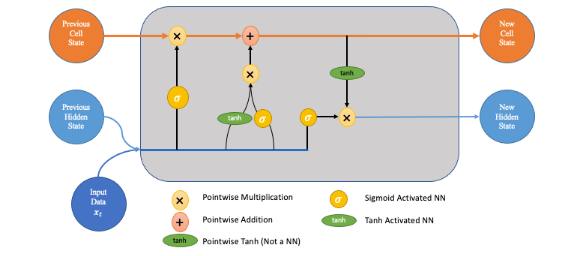
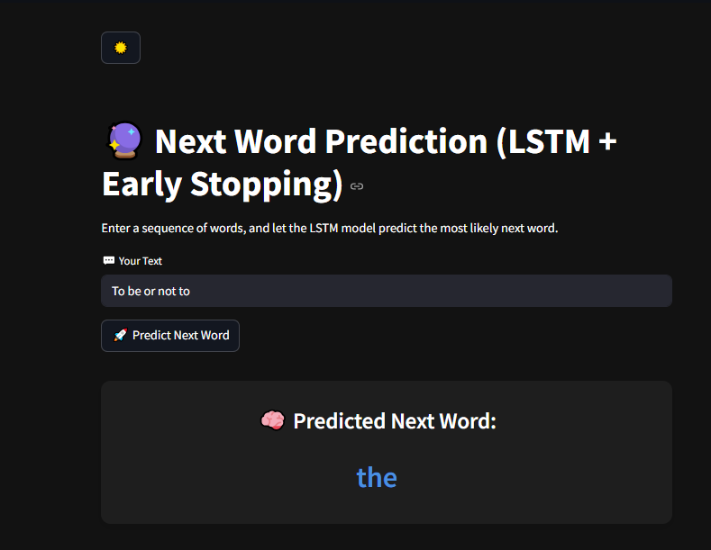

# 📚 Next Word Prediction Using LSTM



This project applies Long Short-Term Memory (LSTM) networks to predict the **next word** in a given text sequence using Shakespeare’s *Hamlet*. The model learns the structure and patterns of language and generates the next word based on context.

---

## 🚀 Project Overview

Next Word Prediction is a core problem in Natural Language Processing (NLP), often used in autocomplete systems. In this project, we:

- Collected and saved Shakespeare's *Hamlet* using NLTK’s Gutenberg corpus  
- Preprocessed and tokenized the dataset into sequences  
- Built and trained an LSTM model using TensorFlow/Keras  
- Evaluated the model by generating predictions on sample sequences  
- Built a Streamlit app to interactively predict the next word  

---

## 🛠️ Tools & Technologies

| Tool             | Logo |
|------------------|------|
| Python           |  |
| Pandas           |  |
| NumPy            |  |
| TensorFlow       |  |
| Keras            |  |
| Streamlit        |  |
| NLTK             |  |
| Jupyter Notebook |  |

---

## 🧠 Model Architecture

- Embedding Layer  
- LSTM Layer 1  
- LSTM Layer 2  
- Dense Output Layer with Softmax Activation

---

## 📊 Dataset

- **Source**: Shakespeare's *Hamlet* from the Gutenberg corpus via NLTK  
- **Extraction Code**:

```python
import nltk
nltk.download('gutenberg')
from nltk.corpus import gutenberg

data = gutenberg.raw('shakespeare-hamlet.txt')
with open('data/hamlet.txt', 'w') as file:
    file.write(data)
```

## 🌐 Streamlit App




 ## 🖥️ Installation & Usage

### 🔹 Clone the repository:

```bash
git clone https://github.com/achraf-bogryn/LSTM-NextWordGen.git
cd LSTM-NextWordGen
```

### 🔹 Install the required packages:
```bash
pip install -r requirements.txt
```

### 🔹 Run the Streamlit App:
```bash
cd streamlit_App
streamlit run app.py
```

### 📦 Project Structure
```bash 
sentiment-analysis-imdb/
│
├── streamlit_App/app.py                       # Streamlit interface
├── models/imdb_rnn_model.h5                   # model and transfomation on dataset
├── images/                                    # Visual assets for README
├── requirements.txt                           # Dependencies
├── data/                                      # Data as text file
├── Lstm/Rnn                                   # Jupyter Notebook  
└── README.md
```


